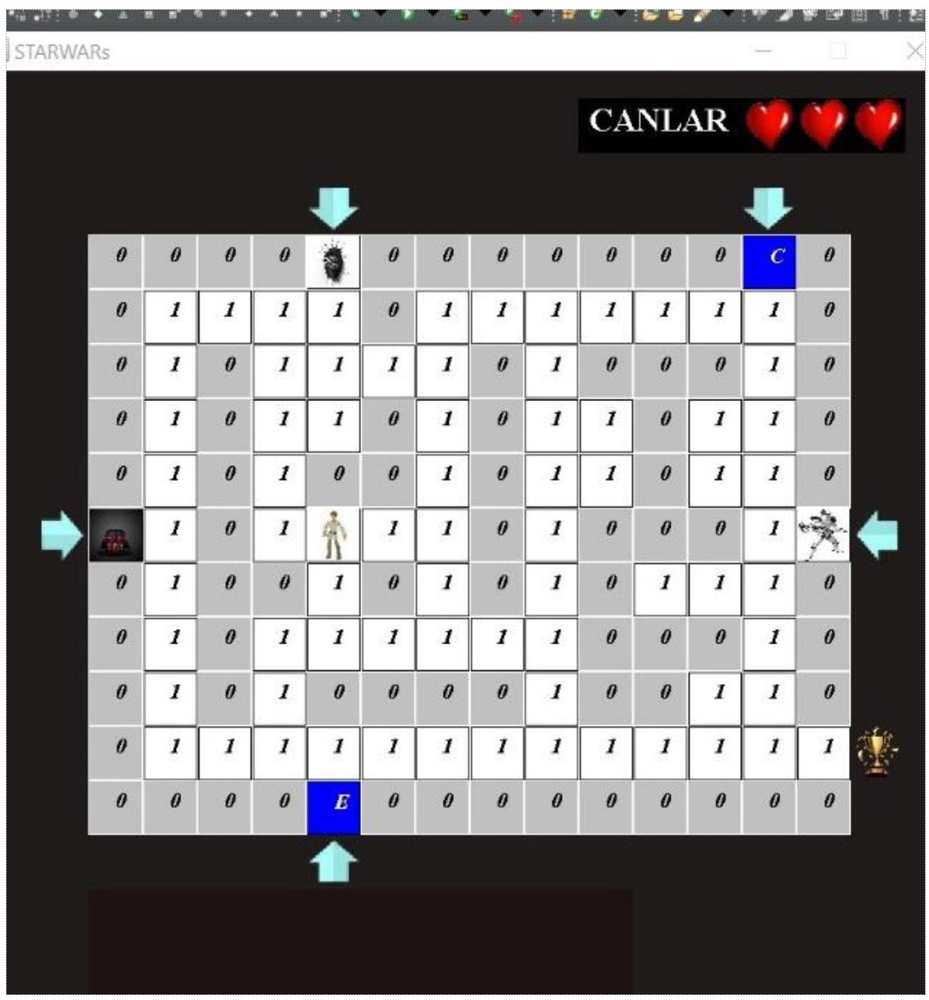
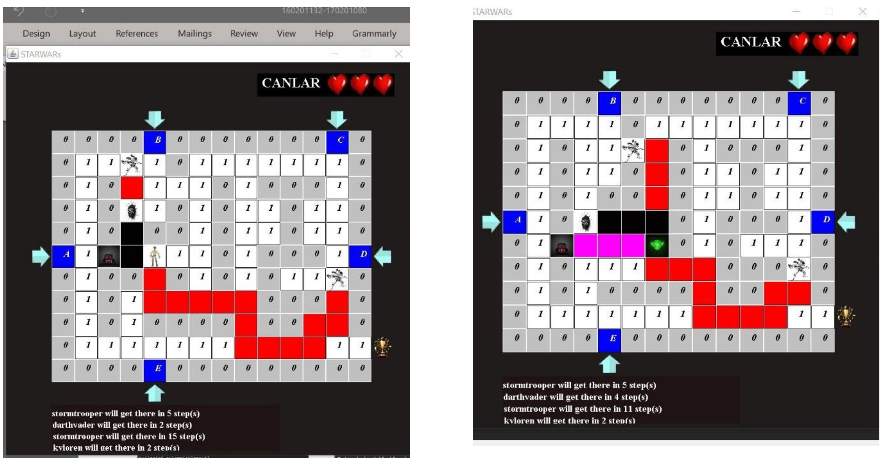

# prolab-ii-i-starwars

Kocaeli universitesi, prolab II I

<br />


<!-- ABOUT THE PROJECT -->
## About The Project

<p>
Bu bir oyun programıdır.
İyi karakterler ve kötü karakterler bulunmakta.
kullanıcı birbirinden ayrı özellikleri olan iyi karakterlerden herhangi birini seçtikten sonra oyunu başlatmaktadır.
Oyuncunun amacı labirent çıkışına kötü karakterlere yakalanmadan varabilmektir.
Kötü karakterlerin türü, sayısı ve labirentin hangi kapısında olacağı verilen Harita.txt dosyasında yazmaktadır.
Kullanıcı çıkışa varana veya kötü karakter, iyi karakteri yakalayana dek oyun devam etmekte;
<!--
yakalandığında ise iyi karakterin canı bitene değin yeniden başlamaktadır.
</p>
<div style="margin:1% 10%;">

</div>
-->

### Built With

Bu proje **`Java`** programlama dilinde geliştirilmiş.
Projeyi gerçeklerken 

* java.util.ArrayList, 
* java.awt.Color, 
* java.util.Scanner, 
* java.IO.BufferedReader, 
* java.io.FileReader, 
* java.io.IOException 

gibi kütüphanelerden yararlanılmıştır.

## Getting Started

Proje kurulumu oldukça açıklayıcıdır. Projeyi yerel makinenize klonladıktan sonra,
favori IDE'nizi kullanarak projeyi içe aktarın ve maven kullanarak oluşturun. and you are good to go...



### Installation
1. Clone the repo
   ```sh
   git https://github.com/possenalain/prolab-ii-i-starwars.git
   ```
2. Import the project into your IDE.
3. build with maven.


<!-- USAGE EXAMPLES -->
## Usage


<!-- ROADMAP -->
## catalog

- [x] Program harita.txt dosyasını okur.
- [x] harita.txt dosyası okurken ilk sıradan başlayarak karakter bilgileri okur ve 0 ile 1 oluşan labirent bilgiyi okur.
- [x] Okunduğu bilgilerinden kotu karakter listi oluşturulur ve labirenti çizilir.


<!-- CONTRIBUTING -->
## Contributing

Contributions are what make the open source community such an amazing place to learn, inspire, and create. Any contributions you make are **greatly appreciated**.

If you have a suggestion that would make this better, please fork the repo and create a pull request. You can also simply open an issue with the tag "enhancement".
Don't forget to give the project a star! Thanks again!

1. Fork the Project
2. Create your Feature Branch (`git checkout -b feature/AmazingFeature`)
3. Commit your Changes (`git commit -m 'Add some AmazingFeature'`)
4. Push to the Branch (`git push origin feature/AmazingFeature`)
5. Open a Pull Request


<!-- LICENSE -->
## License

Distributed under the MIT License. See `LICENSE.txt` for more information.

<!-- CONTACT -->
## Contact

Project Link: [https://github.com/possenalain/prolab-ii-i-starwars.git](https://github.com/possenalain/prolab-ii-i-starwars.git)


