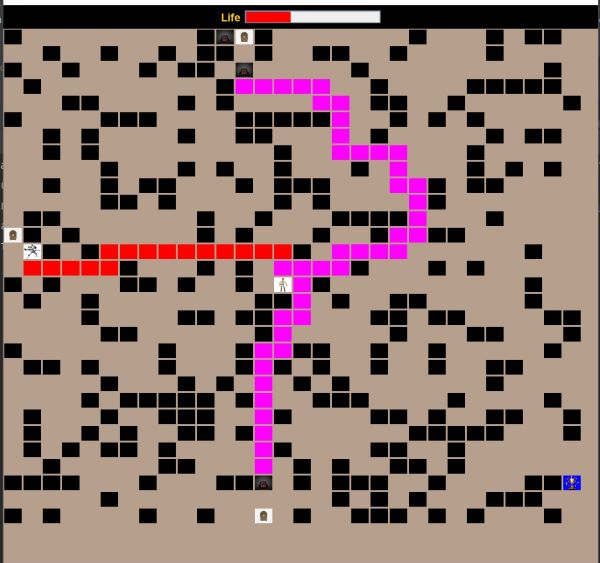

# prolab-ii-i-starwars

Kocaeli universitesi, prolab II I
<br />


<!-- ABOUT THE PROJECT -->
## About The Project

<p>
This is a shortest distance problem. 

To begin with a grid of n x m size is created.
<br/>
There will be a grid with obstacles as walls and pathway. 
<br/>
There are good and bad characters with different capacity and specialities.
<br/>
Characters are placed on the grid.
<br/>
Each character will have an entry point or initial location on the grid.

<b>While a good characters tries to reach the end point to get a trophy, hunters or bad characters try to reach him by finding the shortest path and following it.</b>
</p>

## Characters

### Good

there are two main characters refered to as good characters in the game.
#### LukeSkyWalker
   - LukeSkyWalker can move n steps in a given direction( automatically or controlled by user)
   - LukeSkyWalker will have limited life compared to othere characters he is the weakest.
   ...
   
#### Master Yoda
   - Same as LukeSkyWalker, he can move n steps in any direction
   - Master yoda is a die hard and has 2 times longer life than LukeSkyWalker
   - Master yoda can use doors on the board as shortcut or portals to the otherside of the board.
   ...
### Bad [ Hunters ]

<p>- It is the purpose of a hunter to find the shortest path the good character which is a moving target. </p>

#### Kyloren 
   <p>
   Considerably the weakest of all. 
   <br />
   He can move 1 step(s)
   <br />
   </p>

#### StormTrooper
   <p>
   Can move 2 steps in direction.
   <br />
   Can use doors as getway to the other side
   <br />
   Has a limited number of times he can go through walls i.e obstacles.
   </p>

#### DarthVader
   <p>
   Can move n steps in a given direction. 
   <br />
   He can use doors. 
   <br />
   Can move though walls n given times.
   </p>


## Up and Running


### Built With

 The project is sorely build in **`Java`**.
 
 
## Getting Started

In your favourite Java IDE you will need to clone this repository.
maven will set up all required dependencies.
run UserInterface java file and you are good to go...

   ### Installation
   1. Clone the repo
      ```sh
      git https://github.com/possenalain/prolab-ii-i-starwars.git
      ```
   2. Import the project into your IDE.
   3. build with maven.


## Catalog

- [x] Reading harita.txt (bootstraping file) the game gets initialized.
- [x] choose with which character you would play as.
- [x] game board (labyrinth). is the created thus the game starts.
- [x] ...


## issues

<p>Depending on the size of the labyrinth represented as a matrix the time it takes to find the shortest path gets high</p>

<p>In the future I intend to use dynamic programming and find all best routes from any point to anyother on the grid instead of recalculating every single time a character makes a move. </p>
<!-- CONTRIBUTING -->
## Contributing

Contributions are what make the open source community such an amazing place to learn, inspire, and create. Any contributions you make are **greatly appreciated**.

If you have a suggestion that would make this better, please fork the repo and create a pull request. You can also simply open an issue with the tag "enhancement".
Don't forget to give the project a star! Thanks again!

1. Fork the Project
2. Create your Feature Branch (`git checkout -b feature/AmazingFeature`)
3. Commit your Changes (`git commit -m 'Add some AmazingFeature'`)
4. Push to the Branch (`git push origin feature/AmazingFeature`)
5. Open a Pull Request


<!-- LICENSE -->
## License

Distributed under the MIT License. See `LICENSE.txt` for more information.

<!-- CONTACT -->
## Contact

Project Link: [https://github.com/possenalain/prolab-ii-i-starwars.git](https://github.com/possenalain/prolab-ii-i-starwars.git)


